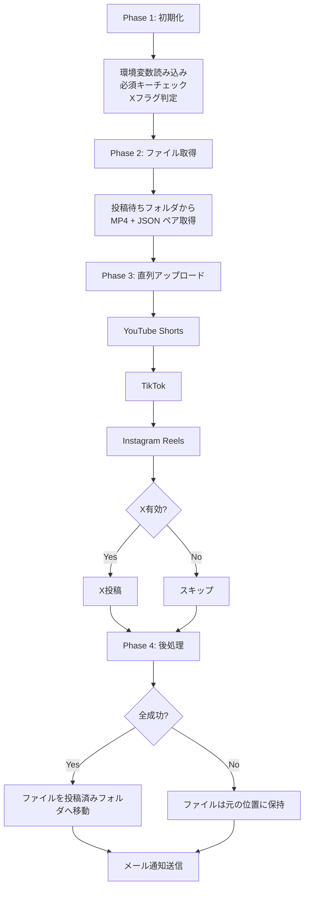

# SNS自動投稿バッチシステム - 実装完了ウォークスルー

## 概要

設計書に基づき、Google Driveを起点として複数SNS（YouTube / TikTok / Instagram / X）へ動画を自動投稿するTypeScriptバッチシステムを実装しました。

## ディレクトリ構成

```
SNS_HUB/
├── .github/workflows/batch.yml     # GitHub Actions（毎日19:00 JST）
├── src/
│   ├── config/env.ts               # 環境変数管理・バリデーション
│   ├── types/index.ts              # 全型定義
│   ├── services/
│   │   ├── drive.ts                # Google Drive API
│   │   ├── youtube.ts              # YouTube Shorts
│   │   ├── tiktok.ts               # TikTok Direct Post
│   │   ├── instagram.ts            # Instagram Reels
│   │   ├── x.ts                    # X (条件付き)
│   │   └── mail.ts                 # Gmail通知
│   ├── utils/logger.ts             # ログユーティリティ
│   └── index.ts                    # メインフロー制御
├── .env.example                    # 環境変数テンプレート
├── .gitignore
├── package.json
└── tsconfig.json
```

## 処理フロー



## 主要な設計ポイント

| 設計項目 | 実装内容 |
|---------|---------|
| X条件付き実行 | 環境変数の有無で`isXEnabled`フラグを自動設定 |
| 直列実行 | YouTube→TikTok→Instagram→Xの順に直列で実行 |
| 逐次ステータス更新 | 各SNS成功時にGoogle Drive上のJSONを即時更新 |
| 成功判定 | X無効時はYT/TT/IGのみ、X有効時は全4媒体で判定 |
| エラーハンドリング | 1媒体の失敗がバッチ全体を停止させない設計 |
| メール通知 | HTML形式のバッジ付きサマリーレポート |

## 検証結果

- ✅ `npm install` — 69パッケージインストール成功
- ✅ `npx tsc --noEmit` — TypeScriptコンパイルエラー **ゼロ**

## 次のステップ

1. GitHub リポジトリにpush
2. GitHub Secretsに認証情報を登録（`.env.example` 参照）
3. Google Driveに「投稿待ちフォルダ」と「投稿済みフォルダ」を作成
4. 手動実行（workflow_dispatch）でE2Eテスト
# sns-auto-publisher
